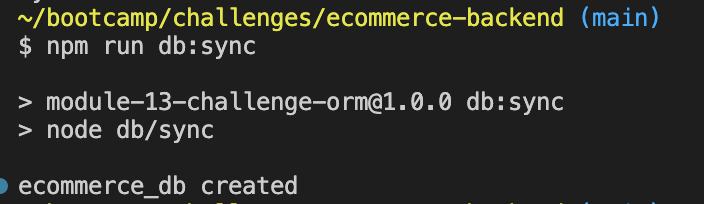
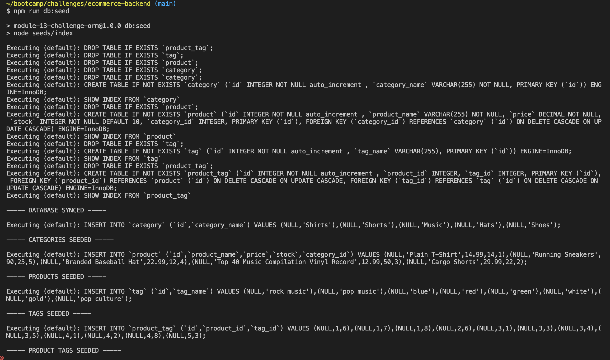
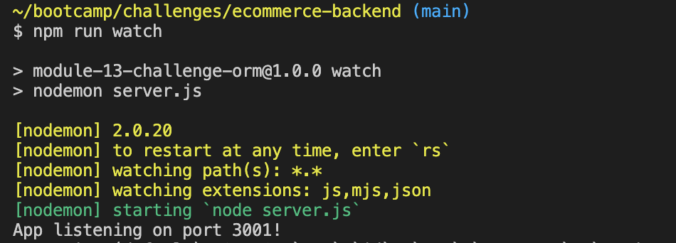
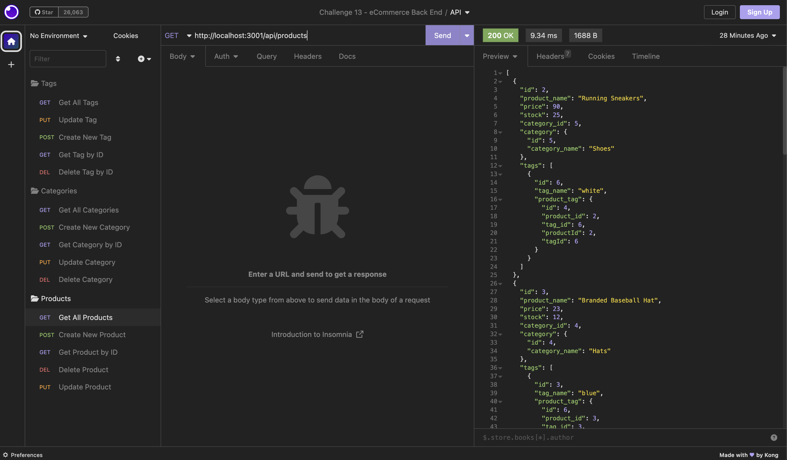

# Challenge 13 - E-Commerce Backend

[Walk-through Video](https://drive.google.com/file/d/18-ETjsaHtJMOlVok0lmBfOYR6lzFsoE2/view)

## Table of Contents
- [Description](#Description)
- [Usage](#Usage)
- [Visuals](#Visuals)

## Description

This application is the backend of an e-commerce site, utilizing an Express.js API and using Sequelize to interact with a MySQL database. It has functionality to get all item data from a table or a singular item's data from a table by a primary key. It also has functionality to create new items given inputted information, update items with the inputted information, and/or delete items by a primary key. Please refer to the walk-through video above or the [Usage Instructions](#Usage) to see how it works.

## Usage

To run this application, follow the instructions below:

While in the terminal or bash, enter the following command to sync and create the database:

```js
npm run db:sync
```



Next, run this command to seed the database:

```js
npm run db:seed
```



Next, run this command to start the application's server:

```js
npm run watch
```



## Visuals
